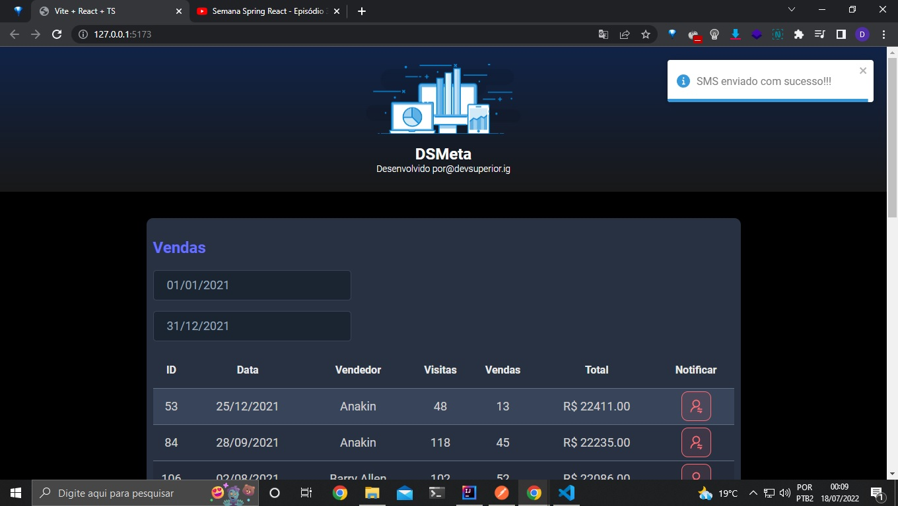

# SemanaDevSuperior
Semana desafio dev superior - professor Nelio 
Proposta do desafio: Criar um app de consulta de vendas, no qual você poderá buscar vendas em um dado intervalo de datas, e poderá notificar via SMS os dados dos melhores vendedores. Vamos construir o back end com Java e Spring, e o front end com React.  
Link do site hospedado no netlify na nuvem em: https://dsmetadiego.netlify.app  
Link da API hospedado no Herokun na nuvem em: https://dsmeta-diegobrandao.herokuapp.com/sales

<strong>-Página Home da Aplicação</strong>

Imagem do site na nuvem

